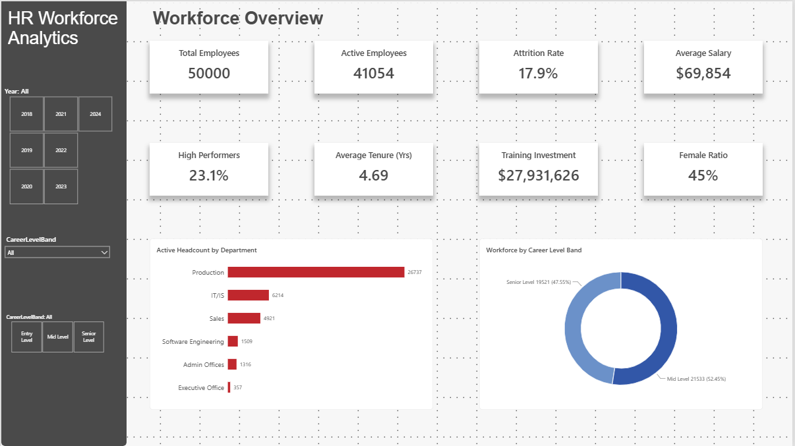
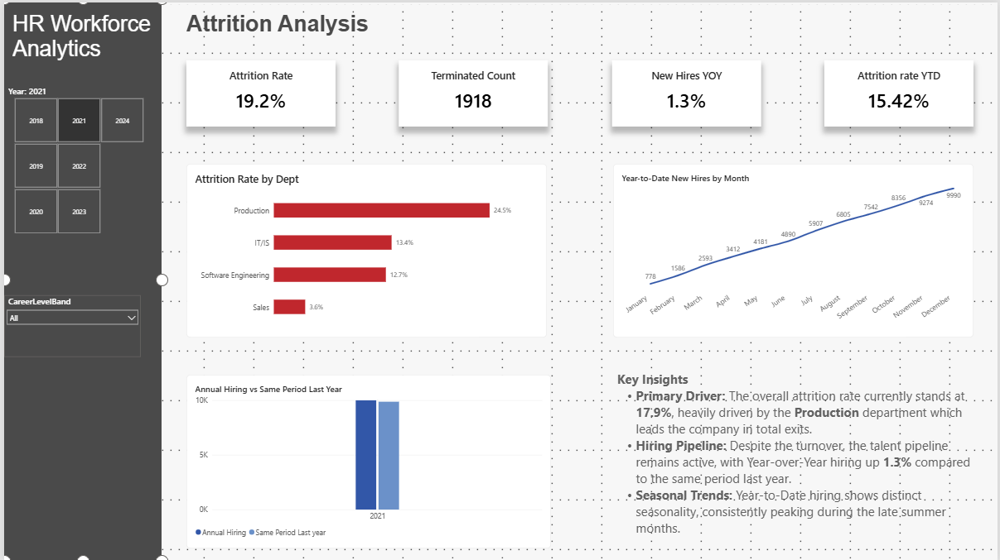
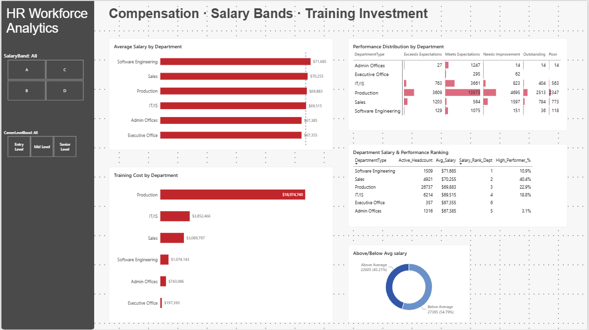

<div align="center">


<br/>


<br/>

> **A comprehensive 3-page Power BI report delivering real-time workforce intelligence across 50,000 employees — spanning headcount, attrition, compensation, and performance analytics.**

<br/>

</div>

---

## 🏆 At a Glance

<div align="center">

| 👥 Total Employees | ✅ Active | 📉 Attrition | 💰 Avg Salary |
|:---:|:---:|:---:|:---:|
| **50,000** | **41,054** | **17.9%** | **$69,854** |

| ⭐ High Performers | 📅 Avg Tenure | 🎓 Training Budget | 👩 Female Ratio |
|:---:|:---:|:---:|:---:|
| **23.1%** | **4.69 yrs** | **$27.9M** | **45%** |

</div>

---

## 📋 Table of Contents

- [📸 Dashboard Preview](#-dashboard-preview)
- [🗂️ Dashboard Pages](#️-dashboard-pages)
- [📐 DAX Measures](#-dax-measures)
- [🔢 Key Data Points](#-key-data-points)
- [🎛️ Filters & Slicers](#️-filters--slicers)
- [💡 Business Insights](#-business-insights)
- [🛠️ Tech Stack](#️-tech-stack)
- [📁 File Structure](#-file-structure)

---

## 📸 Dashboard Preview

<table>
  <tr>
    <td align="center"><b>🏠 Workforce Overview</b></td>
    <td align="center"><b>📉 Attrition Analysis</b></td>
    <td align="center"><b>💰 Compensation & Training</b></td>
  </tr>
  <tr>
    <td></td>
    <td></td>
    <td></td>
  </tr>
</table>

---

## 🗂️ Dashboard Pages

### `PAGE 01` &nbsp; Workforce Overview


> A command-center view of total workforce health — headcount, performance, tenure, and diversity in a single glance.

**KPI Cards**

| Metric | Value | Description |
|--------|-------|-------------|
| 👥 Total Employees | `50,000` | Full historical headcount |
| ✅ Active Employees | `41,054` | Currently employed |
| 📉 Attrition Rate | `17.9%` | Overall turnover rate |
| 💰 Average Salary | `$69,854` | Company-wide mean |
| ⭐ High Performers | `23.1%` | Outstanding + Exceeds Expectations |
| 📅 Avg Tenure | `4.69 yrs` | Mean years of service |
| 🎓 Training Investment | `$27,931,626` | Total training spend |
| 👩 Female Ratio | `45%` | Gender representation |

**Visual Components**
- 📊 **Horizontal Bar Chart** — Active Headcount by Department
- 🍩 **Donut Chart** — Career Level Band split (Mid 52.45% · Senior 47.55%)

---

### `PAGE 02` &nbsp; Attrition Analysis


> Deep-dives into turnover patterns, seasonal hiring cycles, and year-over-year pipeline health.

**KPI Cards** *(Year 2021)*

| Metric | Value |
|--------|-------|
| 📉 Attrition Rate | `19.2%` |
| 🚪 Terminated Count | `1,918` |
| 📈 New Hires YOY | `+1.3%` |
| 📅 Attrition Rate YTD | `15.42%` |

**Attrition by Department**

| Department | Rate | Risk Level |
|------------|------|-----------|
| 🏭 Production | 24.5% | 🔴 High |
| 💻 IT/IS | 13.4% | 🟡 Medium |
| ⚙️ Software Engineering | 12.7% | 🟡 Medium |
| 🛒 Sales | 3.6% | 🟢 Low |

**Key Embedded Insights**
> 🔴 **Primary Driver** — Production leads all exits at **24.5%** attrition  
> 📈 **Hiring Pipeline** — YOY hiring up **1.3%** despite elevated turnover  
> 🌤️ **Seasonal Trends** — Hiring consistently peaks in **late summer months**

---

### `PAGE 03` &nbsp; Compensation · Salary Bands · Training Investment


> Benchmarks pay equity, training allocation, and performance distribution — all in one compensation command center.

**Average Salary Ranking**

| Rank | Department | Avg Salary | High Performer % |
|------|------------|-----------|-----------------|
| 🥇 1 | Software Engineering | `$71,685` | 10.9% |
| 🥈 2 | Sales | `$70,255` | 40.4% |
| 🥉 3 | Production | `$69,883` | 22.9% |
| 4 | IT/IS | `$69,515` | 18.8% |
| 5 | Admin Offices | `$67,385` | 3.1% |
| 6 | Executive Office | `$67,355` | — |

**Salary Distribution**

```
Above Average ██████████████████░░░░░░░░░░░░░  45.21%  (22,605 employees)
Below Average ░░░░░░░░░░░░░░░░░░████████████████  54.79%  (27,395 employees)
```

---

## 📐 DAX Measures

### 👥 Workforce Metrics

```dax
-- Total headcount in the dataset
Total Employees =
    COUNT(Employee[EmployeeID])

-- Count of currently active employees
Active Employees =
    CALCULATE(
        COUNT(Employee[EmployeeID]),
        Employee[Status] = "Active"
    )

-- Overall attrition rate
Attrition Rate =
    DIVIDE(
        CALCULATE(COUNT(Employee[EmployeeID]), Employee[Status] = "Terminated"),
        COUNT(Employee[EmployeeID])
    )

-- High performer percentage
High Performers % =
    DIVIDE(
        CALCULATE(
            COUNT(Employee[EmployeeID]),
            Employee[PerformanceRating] IN {"Outstanding", "Exceeds Expectations"}
        ),
        COUNT(Employee[EmployeeID])
    )

-- Average years of service
Average Tenure (Yrs) =
    AVERAGE(Employee[TenureYears])

-- Gender ratio
Female Ratio =
    DIVIDE(
        CALCULATE(COUNT(Employee[EmployeeID]), Employee[Gender] = "Female"),
        COUNT(Employee[EmployeeID])
    )
```

### 💰 Compensation Metrics

```dax
-- Mean salary across filtered employees
Average Salary =
    AVERAGE(Employee[Salary])

-- Total training spend
Training Investment =
    SUM(Employee[TrainingCost])

-- Employees earning above company average
Above Avg Salary Count =
    CALCULATE(
        COUNT(Employee[EmployeeID]),
        Employee[Salary] > [Average Salary]
    )

-- Salary rank within each department
Salary_Rank_Dept =
    RANKX(
        ALL(Employee[DepartmentType]),
        [Average Salary], , DESC
    )
```

### 📉 Attrition & Hiring Metrics

```dax
-- Count of terminated employees
Terminated Count =
    CALCULATE(
        COUNT(Employee[EmployeeID]),
        Employee[Status] = "Terminated"
    )

-- Year-over-year new hire growth
New Hires YOY =
    DIVIDE(
        CALCULATE(COUNT(Employee[EmployeeID]),
            Employee[HireYear] = MAX(Employee[HireYear]))
        - CALCULATE(COUNT(Employee[EmployeeID]),
            Employee[HireYear] = MAX(Employee[HireYear]) - 1),
        CALCULATE(COUNT(Employee[EmployeeID]),
            Employee[HireYear] = MAX(Employee[HireYear]) - 1)
    )

-- Year-to-date attrition rate
Attrition Rate YTD =
    CALCULATE(
        [Attrition Rate],
        DATESYTD(DateTable[Date])
    )

-- Department-level attrition
Attrition Rate by Dept =
    DIVIDE(
        CALCULATE([Terminated Count], ALLEXCEPT(Employee, Employee[DepartmentType])),
        CALCULATE([Total Employees],  ALLEXCEPT(Employee, Employee[DepartmentType]))
    )
```


## 🔢 Key Data Points

<details>
<summary><b>👥 Active Headcount by Department</b></summary>

| Department | Active Employees | Share |
|------------|-----------------|-------|
| 🏭 Production | 26,737 | 65.1% |
| 💻 IT/IS | 6,214 | 15.1% |
| 🛒 Sales | 4,921 | 12.0% |
| ⚙️ Software Engineering | 1,509 | 3.7% |
| 🏢 Admin Offices | 1,316 | 3.2% |
| 🏛️ Executive Office | 357 | 0.9% |

</details>

<details>
<summary><b>🎓 Training Cost by Department</b></summary>

| Department | Training Spend | % of Total |
|------------|---------------|-----------|
| 🏭 Production | $18,974,740 | 67.9% |
| 💻 IT/IS | $3,852,466 | 13.8% |
| 🛒 Sales | $3,089,797 | 11.1% |
| ⚙️ Software Engineering | $1,074,143 | 3.8% |
| 🏢 Admin Offices | $743,086 | 2.7% |
| 🏛️ Executive Office | $197,393 | 0.7% |
| **Total** | **$27,931,626** | **100%** |

</details>

<details>
<summary><b>🎯 Performance Distribution by Department</b></summary>

| Department | Outstanding | Exceeds | Meets | Needs Improvement | Poor |
|------------|------------|---------|-------|-------------------|------|
| Admin Offices | 14 | 27 | 1,247 | 14 | 14 |
| Executive Office | — | — | 295 | 62 | — |
| IT/IS | 404 | 763 | 3,661 | 823 | 563 |
| Production | 2,513 | 3,609 | 13,573 | 4,695 | 2,347 |
| Sales | 784 | 1,203 | 564 | 1,597 | 773 |
| Software Engineering | 36 | 129 | 1,075 | 151 | 118 |

</details>

<details>
<summary><b>📊 Career Level Band Split</b></summary>

| Band | Count | % |
|------|-------|---|
| 🔵 Mid Level | 21,533 | 52.45% |
| 🔷 Senior Level | 19,521 | 47.55% |

</details>


## 💡 Business Insights

<table>
<tr>
<td width="50px" align="center">🔴</td>
<td><b>Production Attrition Crisis</b><br/>With 26,737 employees and a 20.9% attrition rate, Production is both the company's largest and most volatile department. Targeted retention interventions here would have an outsized impact on overall metrics.</td>
</tr>
<tr>
<td align="center">💸</td>
<td><b>Salary-Performance Disconnect</b><br/>Sales earns the 2nd highest salary ($70,255) yet delivers the highest High Performer rate (40.4%) — strong ROI. Software Engineering earns the most ($71,685) but shows only 10.9% high performers — worth investigating.</td>
</tr>
<tr>
<td align="center">🎓</td>
<td><b>Training Budget Concentration</b><br/>Production absorbs 68% of total training spend ($18.9M of $27.9M). Cross-referencing training cost per capita against attrition rates could reveal ROI gaps.</td>
</tr>
<tr>
<td align="center">👩</td>
<td><b>Near-Parity Gender Representation</b><br/>A 45% female ratio signals meaningful diversity progress. A seniority-level breakdown would determine whether representation holds at leadership levels.</td>
</tr>
<tr>
<td align="center">📈</td>
<td><b>Seasonal Hiring Peaks</b><br/>YTD hiring data reveals a consistent late-summer surge (Aug–Sep). Aligning recruiting pipelines and onboarding capacity to this cycle could reduce time-to-fill.</td>
</tr>
<tr>
<td align="center">📏</td>
<td><b>Narrow Salary Band Spread</b><br/>Department averages range only from $67K to $72K — a tight $5K spread. This compression may limit the firm's ability to differentiate compensation for retention of top talent.</td>
</tr>
</table>

---

## 🛠️ Tech Stack

<div align="center">


</div>

| Layer | Technology | Purpose |
|-------|-----------|---------|
| 📊 Visualization | Microsoft Power BI Desktop | 3-page interactive dashboard |
| 🧮 Calculations | DAX (Data Analysis Expressions) | All KPIs, ratios, rankings, YTD/YOY measures |
| 🔄 Data Prep | Power Query (M Language) | Data cleaning, type casting, column transforms |
| 🗃️ Data Source | Internal HR System / CSV | Employee records, 2018–2024 |

---

## 🎨 Design System

| Token | Value | Preview |
|-------|-------|---------|
| Primary | `#C00000` | 🟥 Dark Red |
| Secondary | `#2F5496` | 🟦 Navy Blue |
| Background | `#FFFFFF` | ⬜ White |
| Sidebar | `#3A3A3A` | ⬛ Charcoal |
| Font | `Segoe UI` | Power BI Default |
| Layout | Left nav + content | Fixed sidebar, scrollable main |

---

## 📁 File Structure

```
📦 HR-Workforce-Analytics/
├── 📊 Employee_HR_Analytics_Dashboard.pbix   ← Power BI source (editable)
├── 📄 Employee_HR_Analytics_Dashboard.pdf    ← Static export (3 pages)
├── 🖼️  ss_pg1.png                             ← Workforce Overview screenshot
├── 🖼️  ss_pg2.png                             ← Attrition Analysis screenshot
├── 🖼️  ss_pg3.png                             ← Compensation & Training screenshot
└── 📝 README.md                              ← This file
```

---

<div align="center">

**Built with Microsoft Power BI · DAX · Power Query**

*HR Workforce Analytics Dashboard · v1.0 · June 2026*


</div>